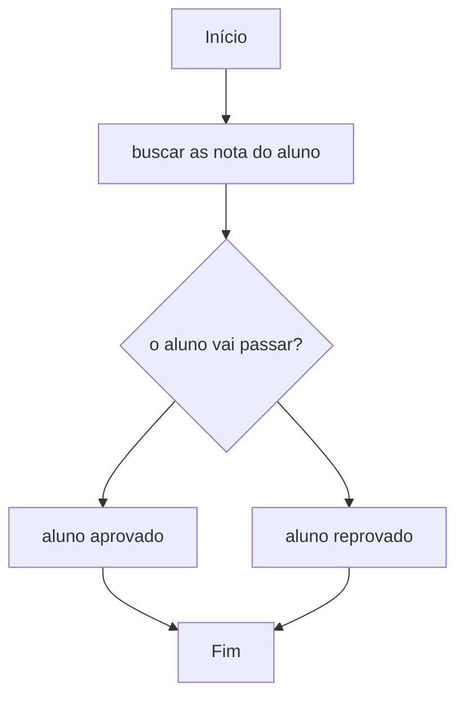

```mermaid
flowchart TD
    inicio["Início"]
    fim["Fim"]
    a1["buscar as nota do aluno"]
    a2{"o aluno vai passar?"}
    a3["aluno aprovado"]
    a4["aluno reprovado"]

    inicio --> a1
    a1 --> a2
    a2 --> a3
    a2 --> a4
    a3 --> fim
    a4 --> fim
```
