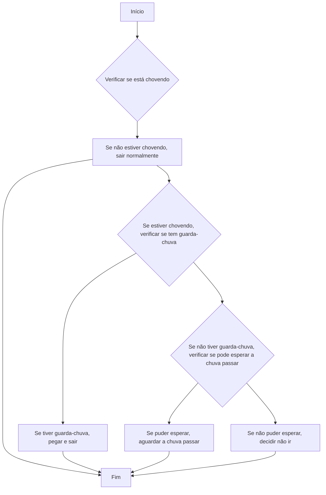

```mermaid
flowchart TD
    inicio["Início"]
    fim["Fim"]
    a1{"Verificar se está chovendo"}
    a2["Se não estiver chovendo, sair normalmente"]
    a3{"Se estiver chovendo, verificar se tem guarda-chuva"}
    a4["Se tiver guarda-chuva, pegar e sair"]
    a5{"Se não tiver guarda-chuva, verificar se pode esperar a chuva passar"}
    a6["Se puder esperar, aguardar a chuva passar"]
    a7["Se não puder esperar, decidir não ir"]


    inicio --> a1
    a1 --> a2
    a2 --> a3
    a2 --> fim
    a3 --> a4
    a3 --> a5
    a4 --> fim
    a5 --> a6
    a5 --> a7
    a6 --> fim
    a7 --> fim
```
